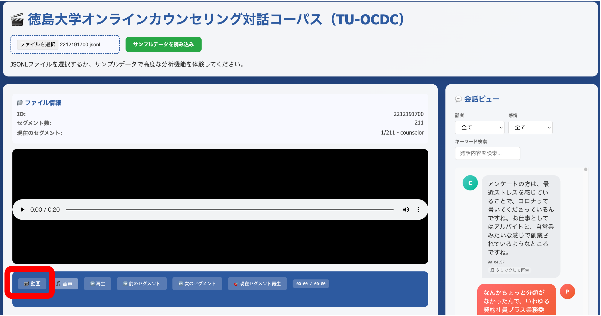
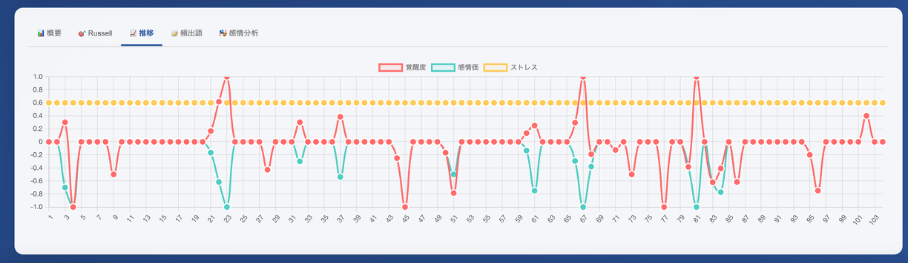
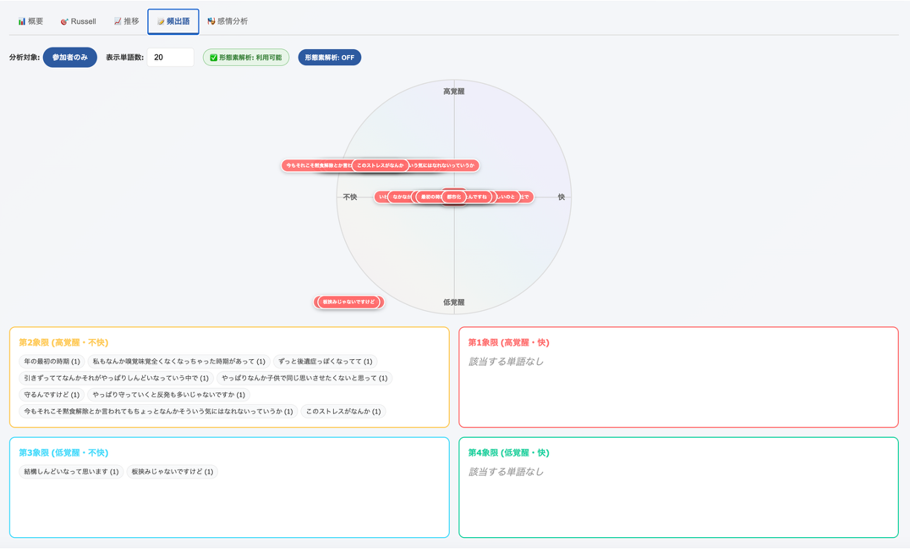
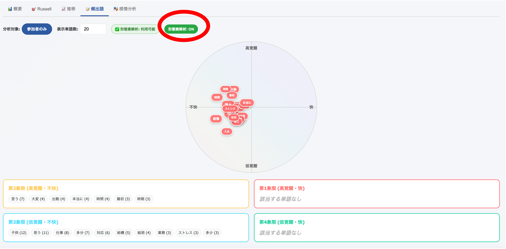
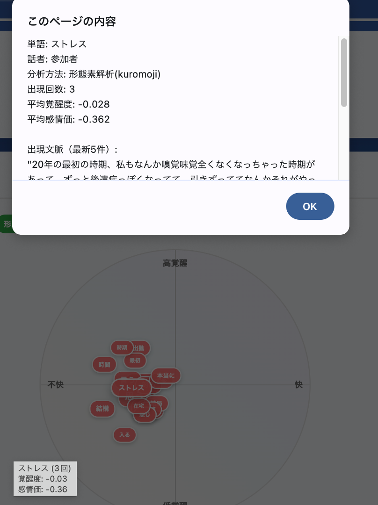
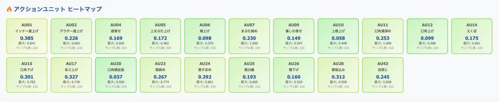
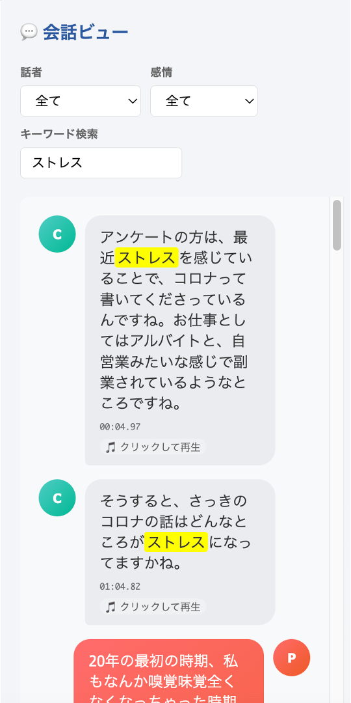

# tuocdcviewer
Tokushima University Online Counseling Dialogue Corpus (TU-OCDC) Viewer
(Base development powered by Claude)

[Japanese version](https://github.com/A2TokushimaUniv/tuocdcviewer/blob/main/README_ja.md)

## Setup
- Place the audio and video directories in the same location as the HTML file (TU-OCDC-viewer-ver1.html)
- Extract jsonl_gpt4_emo or jsonl_reazonv2_emo and place them in the same location as above

## Usage Instructions

### 1. Initial Launch
- Open the HTML file (TU-OCDC-viewer-ver1.html) in a web browser (Recommended: Google Chrome)
- The initial screen displays the message "Please load JSONL file"

*Figure 1: Initial launch screen - State before file selection*

### 2. Dataset Loading
- Click the "Choose File" button
- Select the desired dataset jsonl file (files within jsonl_gpt4_emo or jsonl_reazonv2_emo)
- Click the "Load Sample Data" button to load the data

*Figure 2: File selection screen - Selecting jsonl files*

### 3. Screen Layout and Features

#### Main Screen Components
- **Left Panel**: File information and audio/video player
- **Right Panel**: Conversation view and emotion analysis results
- **Bottom Area**: Analysis tab area (Overview, Russell, Details, Emotion Output, etc.)

*Figure 3: Main screen (Audio playback mode) - Basic screen after data loading*

*Figure 4: Main screen (Video playback mode) - Screen during video file playback*

#### File Information Display
- **ID**: Session ID (e.g., 2212191700)
- **Segment Count**: Total number of segments (e.g., 211)
- **Current Segment**: Currently playing segment number

#### Audio/Video Player
- Automatically plays audio files (.wav) or video files (.mp4)
- Play/pause, volume control, and fullscreen display available
- Progress bar for checking and navigating playback position

#### Control Buttons
- **Forward**: Move to next segment
- **Audio**: Audio-only display mode
- **Backward**: Return to previous segment
- **Previous/Next Segment**: Navigate between segments
- **Next Segment**: Advance to next segment
- **Delete Current Segment**: Skip current segment
- **Start/End**: Navigate to session start/end points

### 4. Conversation View Features

#### Speaker and Emotion Filters
- **Speaker**: Select from "All" or "Participant"
- **Emotion**: Filter by emotion categories such as "All" or "Unpleasant"

#### Keyword Search
- Search utterance content by keywords
- Search results are highlighted

#### Utterance Display
- Each utterance is displayed with speaker icons (C: Counselor, P: Participant)
- Shows utterance time (e.g., 09:07.18) and emotion scores (V: Valence, A: Arousal, S: Stress)
- "Click to play" allows audio/video playback from the corresponding point

### 5. Analysis Tabs

#### Overview Tab
- Displays emotion changes over time for the entire session
- Shows distribution by emotion categories with color coding

*Figure 5: Overview tab - Emotion time series changes and control buttons*

#### Russell Tab
- Displays emotion distribution based on Russell's circumplex model of emotion
- Visualizes emotions on two axes: arousal (high-low) and valence (pleasant-unpleasant)
- Each time point's emotional state is plotted on the circumplex

*Figure 6: Russell tab - Visualization using emotion circumplex model*

*Figure 7: Russell analysis screen - More detailed emotion circumplex display*

#### Details Tab
- Displays more detailed emotion analysis results in graph format
- Confirms time series changes of multiple emotion indicators

*Figure 8: Details tab - Detailed emotion timeline graph*

*Figure 9: Details tab - Detailed information via hover display*

#### Emotion Output Tab
- **Facial Emotion Expression (7 Basic Emotions)**: 
  - Time series display of 7 emotions: joy, anger, surprise, fear, disgust, sadness, neutral
- **Audio Emotion Analysis**:
  - Visualizes emotion data extracted from audio
- **Text Emotion Analysis (8 Emotions)**:
  - 8 types of emotion scores analyzed from text
- **Text Emotion Analysis (Emotion Polarity Values)**:
  - Displays positive/negative polarity numerically

*Figure 10: Emotion output tab - Display of phrases appearing in each emotional domain*

*Figure 11: Emotion output tab - Visualization of frequently used keywords in each emotional domain (morphologically analyzed)*

#### Head Orientation (Pitch, Roll, Yaw)
- Visualizes participant's head movements in 3 axes
- Analyzes non-verbal communication during counseling

#### Action Units (Top 10)
- Detailed analysis results of facial movements
- Heatmap display of time series changes for each Action Unit (AU)

### 6. Advanced Features

#### Detailed Emotion Analysis Information
- Clicking specific emotion categories displays detailed information
- Shows words, speakers, analysis methods, occurrence count, average arousal, and average valence
- Confirms occurrence contexts (latest 5 instances)

*Figure 12: Emotion analysis detail popup - Detailed information display on click*

#### Detailed Emotion Analysis Results Display

*Figure 13: Detailed emotion analysis tab - Facial emotion expression and audio emotion analysis*

#### Text Emotion Analysis

*Figure 14: Text emotion analysis - 8-emotion analysis and emotion polarity values*

#### Head Movement and Facial Expression Analysis

*Figure 15: Head orientation analysis (Pitch, Roll, Yaw) and Action Unit analysis*

*Figure 16: Action Unit details - Heatmap display of top 10*

### 7. Detailed Conversation View Features

#### Detailed Utterance Display

*Figure 17: Conversation view - Utterance details and emotion score display*

#### Keyword Search Function

*Figure 18: Keyword search function - Example search for "stress"*

#### Data Visualization
- All analysis results are displayed in interactive graphs
- Clicking specific points on graphs navigates to corresponding utterances
- Visual understanding of emotion change patterns over time

### 8. Usage Tips
- For identifying areas with large emotion changes, Russell tab's circumplex model is effective
- For emotion analysis with specific keywords, utilize the search function in conversation view
- By comprehensively reviewing the analysis results for each modality (audio, video, and text), you can gain deeper insights
- 
### 9. Notes
- Loading may take time due to large file sizes
- Recommended browser is Google Chrome
- Playback functions are unavailable if audio/video files are not properly placed
