

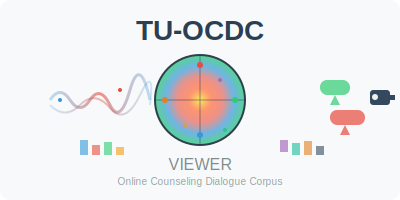

# tuocdcviewer
徳島大学オンラインカウンセリング対話コーパス(TU-OCDC)ビューア
（基盤部分の開発にClaudeを使用）

[英語版](https://github.com/A2TokushimaUniv/tuocdcviewer/blob/main/README.md)

## 準備
- audioディレクトリとvideoディレクトリをHTMLファイル(TU-OCDC-viewer-ver1.html)と同じ場所に配置
- jsonl_gpt4_emoまたはjsonl_reazonv2_emoを解凍し、上記と同じ場所に配置

## 使用方法

### 1. 初期起動
- HTMLファイル(TU-OCDC-viewer-ver1.html)をWebブラウザで開く（推奨：Google Chrome）
- 初期画面では「JSONLファイルを読み込んでください」というメッセージが表示される

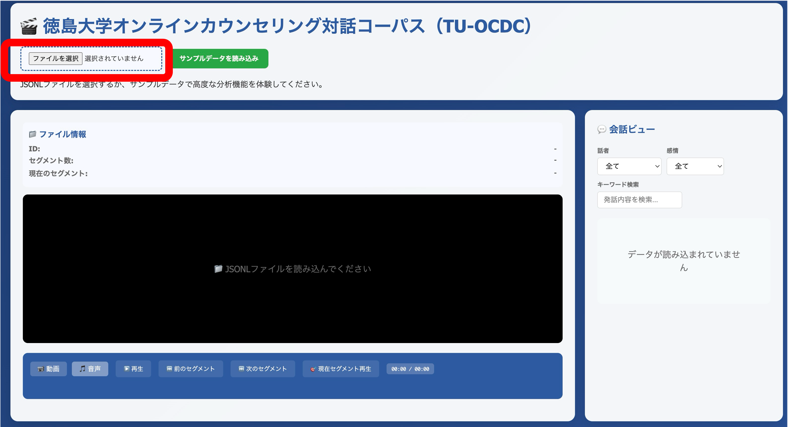
*図1: 初期起動画面 - ファイル選択前の状態*

### 2. データセットの読み込み
- 「ファイル選択」ボタンをクリック
- 閲覧したいデータセットのjsonlファイルを選択（jsonl_gpt4_emoまたはjsonl_reazonv2_emo内のファイル）
- 「サンプルデータを読み込み」ボタンをクリックしてデータを読み込む

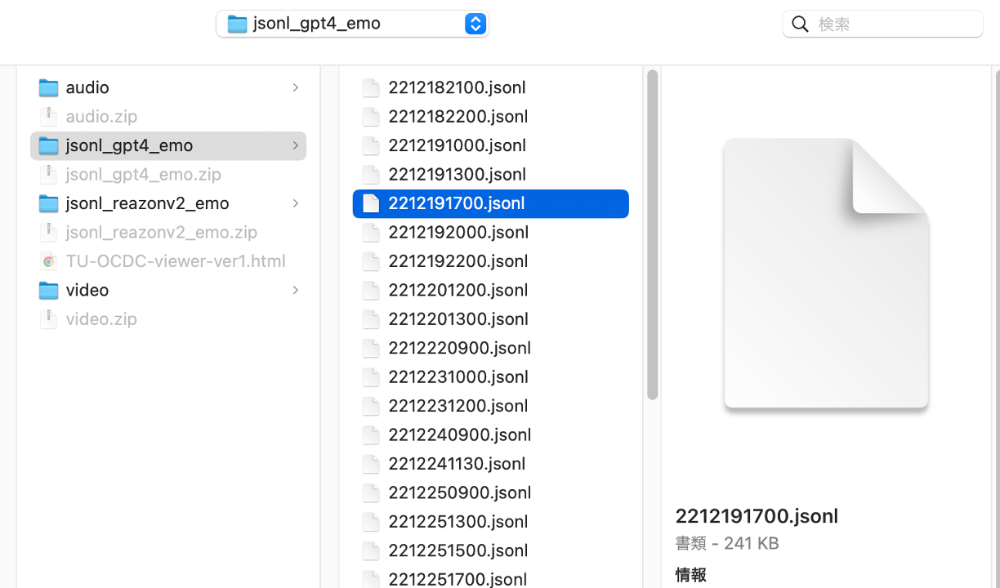
*図2: ファイル選択画面 - jsonlファイルの選択*

### 3. 画面構成と機能

#### メイン画面の構成
- **左側パネル**: ファイル情報と音声/動画プレーヤー
- **右側パネル**: 会話ビューと感情分析結果
- **下部**: 分析タブエリア（概要、Russell、詳細、感情分析結果等）

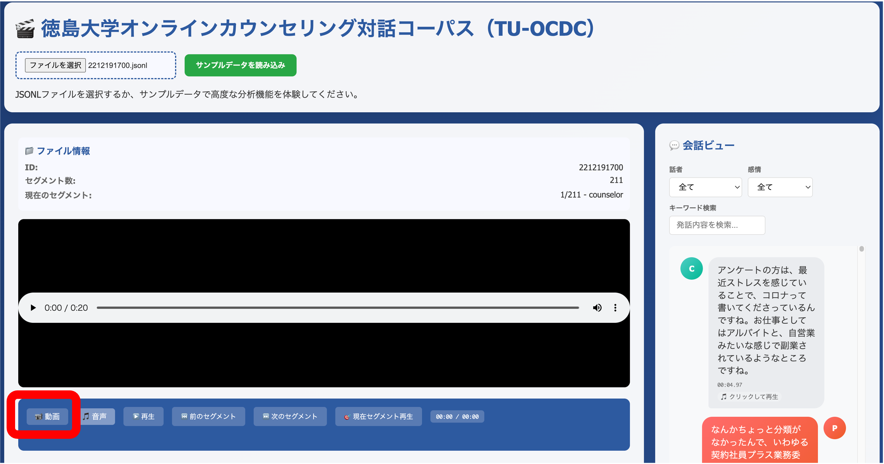
*図3: メイン画面（音声再生モード） - データ読み込み後の基本画面*

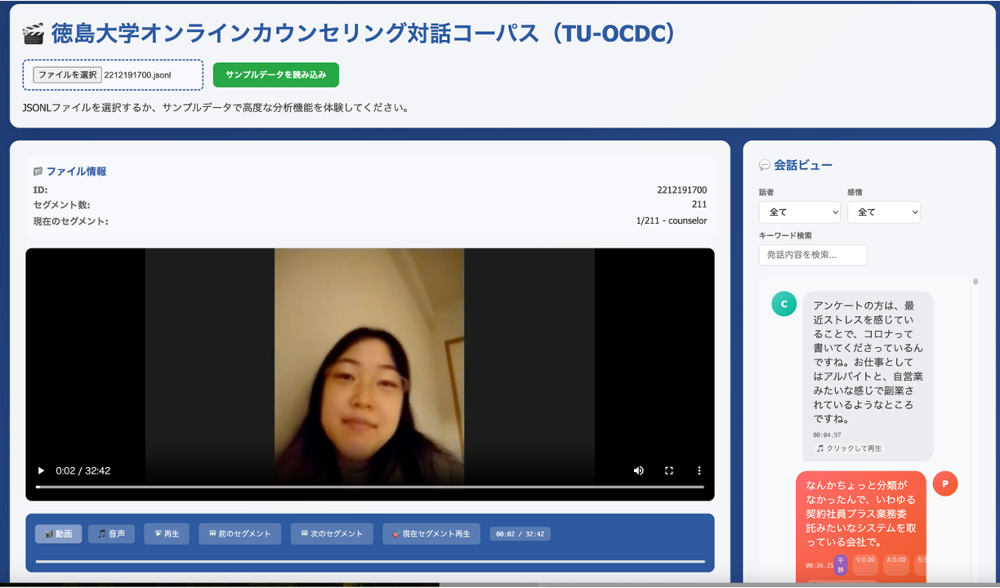
*図4: メイン画面（動画再生モード） - 動画ファイル再生時の画面*

#### ファイル情報表示
- **ID**: セッションID（例：2212191700）
- **セグメント数**: 総セグメント数（例：211）
- **現在のセグメント**: 現在再生中のセグメント番号

#### 音声/動画プレーヤー
- 音声ファイル（.wav）または動画ファイル（.mp4）を自動再生
- 再生/一時停止、音量調整、フルスクリーン表示が可能
- プログレスバーで再生位置の確認と移動が可能

#### 操作ボタン
- **前進**: 次のセグメントに移動
- **音声**: 音声のみ表示モード
- **前後**: 前のセグメントに戻る
- **前後のセグメント**: セグメント間の移動
- **次のセグメント**: 次のセグメントに進む
- **現在のセグメント削除**: 現在のセグメントをスキップ
- **開始/終了**: セッションの開始・終了ポイントに移動

### 4. 会話ビュー機能

#### 話者・感情フィルタ
- **話者**: 「全て」「参加者」から選択可能
- **感情**: 「全て」「不愉快」など感情カテゴリでフィルタ可能

#### キーワード検索
- 発話内容をキーワードで検索可能
- 検索結果はハイライト表示される

#### 発話表示
- 各発話は話者アイコン（C: カウンセラー、P: 参加者）とともに表示
- 発話時間（例：09:07.18）と感情スコア（V: Valence、A: Arousal、S: Stress）を表示
- 「クリックで再生」により該当箇所から音声/動画を再生可能

### 5. 分析タブ

#### 概要タブ
- セッション全体の感情変化を時系列で表示
- 感情カテゴリ別の分布をカラーコードで表示

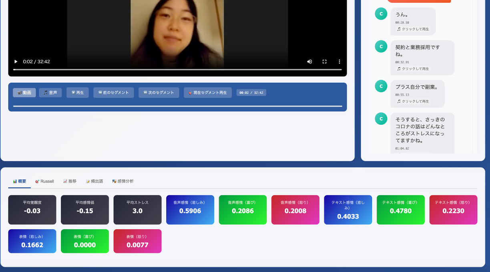
*図5: 概要タブ - 感情やストレスの要約情報*

#### Russellタブ
- Russell の感情円環モデルに基づく感情分布を表示
- 覚醒度（高覚醒-低覚醒）と快適性（快-不快）の2軸で感情を可視化
- 各時点の感情状態が円環上にプロットされる

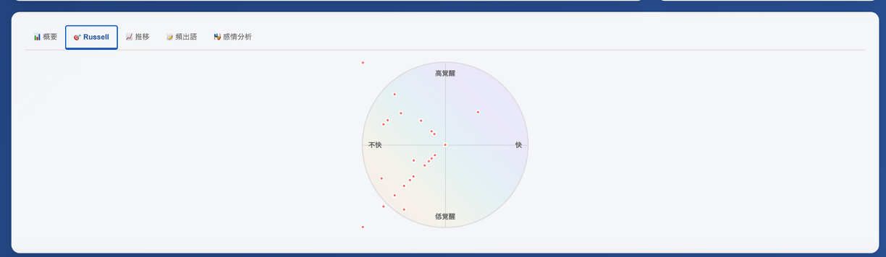
*図6: Russellタブ - 感情円環モデルによる可視化*

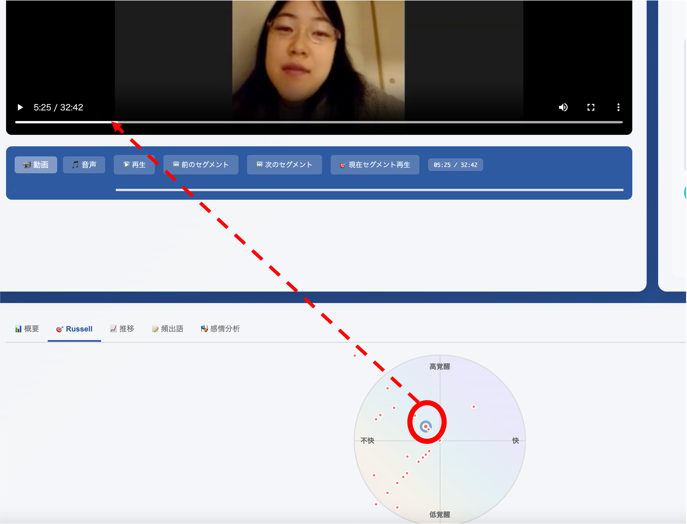
*図7: Russell分析画面 - より詳細な感情円環表示*

#### 詳細タブ
- より詳細な感情分析結果をグラフ表示
- 複数の感情指標の時系列変化を確認可能

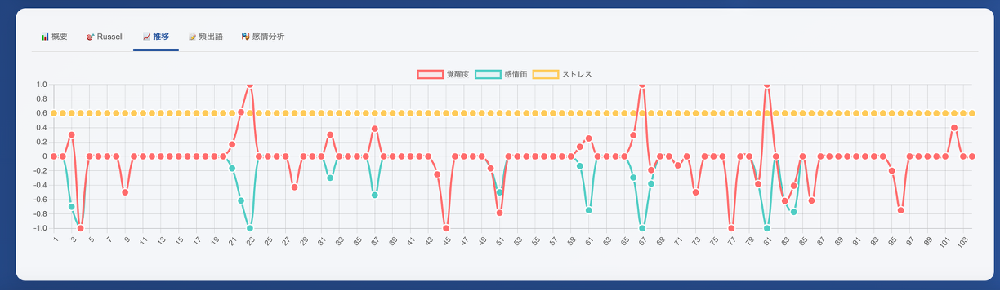
*図8: 詳細タブ - 感情推移の詳細グラフ*

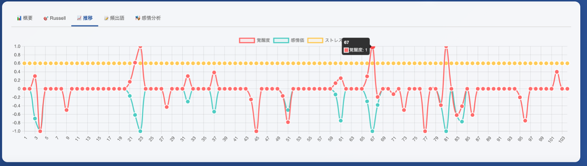
*図9: 詳細タブ - ホバー表示による詳細情報*

#### 感出力タブ
- **顔面感情表現（7つの基本感情）**: 
  - 喜び、怒り、驚き、恐怖、嫌悪、悲しみ、中性の7感情を時系列で表示
- **音声感情分析**:
  - 音声から抽出された感情データを可視化
- **テキスト感情分析（8感情）**:
  - テキストから分析された8種類の感情スコア
- **テキスト感情分析（感情極性値）**:
  - ポジティブ・ネガティブの極性を数値で表示

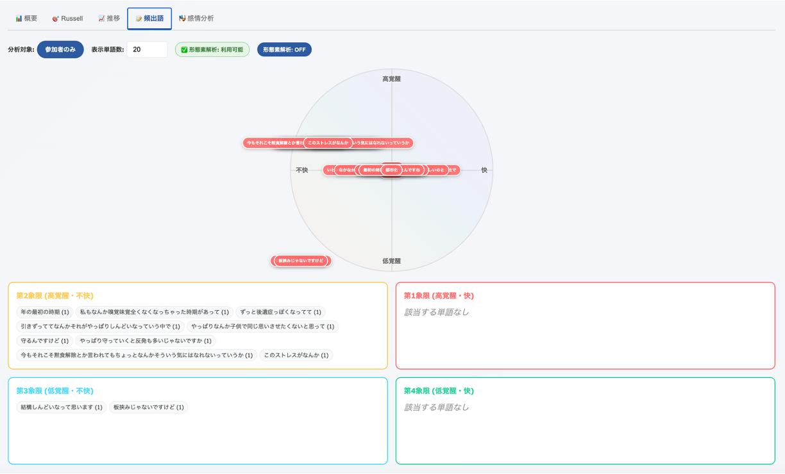
*図10: 感情分析結果タブ - 感情領域ごとの出現フレーズ表示*

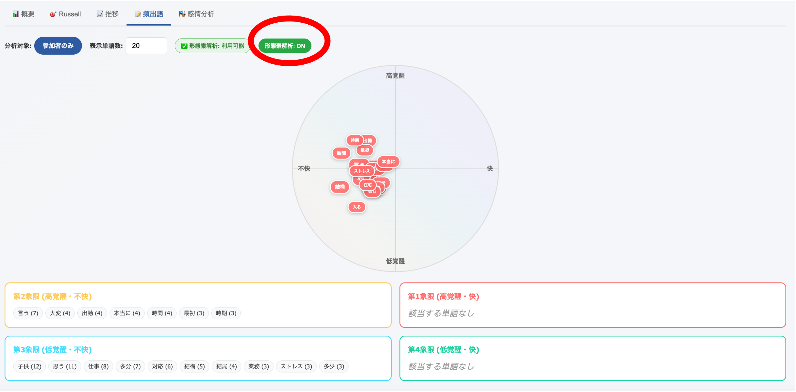
*図11: 感情分析結果タブ - 感情領域ごとの頻出キーワードの可視化（形態素解析済み）*

#### 頭の向き（Pitch, Roll, Yaw）
- 参加者の頭部動作を3軸で可視化
- カウンセリング中の非言語コミュニケーションを分析

#### アクションユニット（上位10個）
- 顔面動作の詳細分析結果
- 各アクションユニット（AU）の時系列変化をヒートマップで表示

### 6. 高度な機能

#### 感情分析の詳細情報
- 特定の感情カテゴリをクリックすると詳細情報を表示
- 単語、話者、分析方法、出現回数、平均覚醒度、平均感情価を表示
- 出現文脈（最新5件）を確認可能

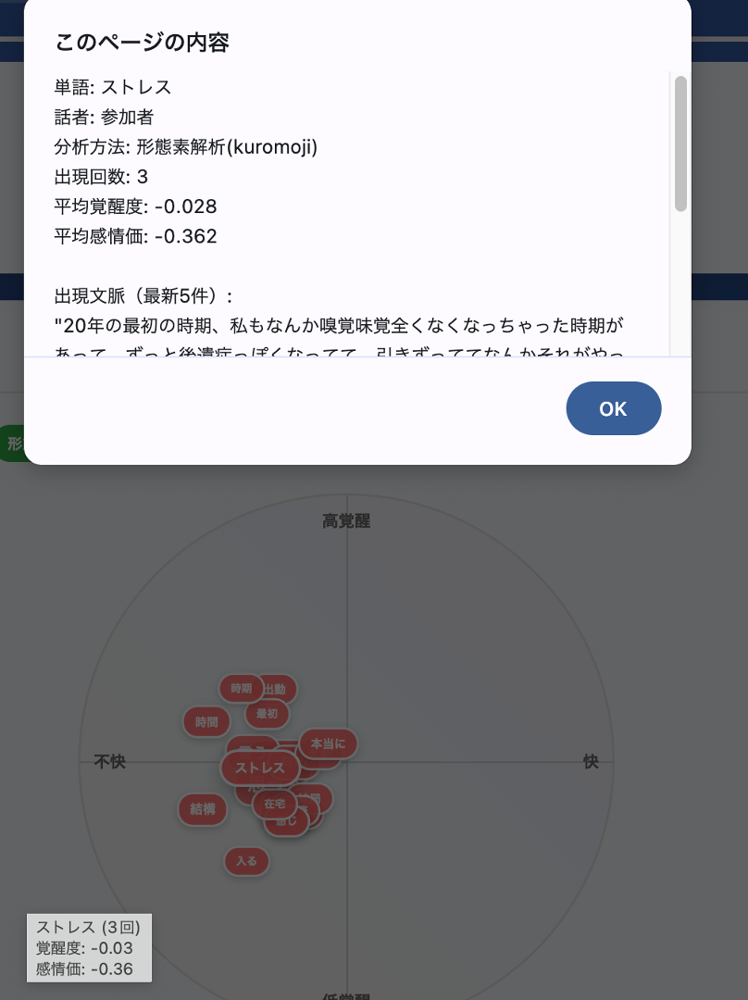
*図12: 感情分析詳細ポップアップ - クリック時の詳細情報表示*

#### 感情分析結果の詳細表示
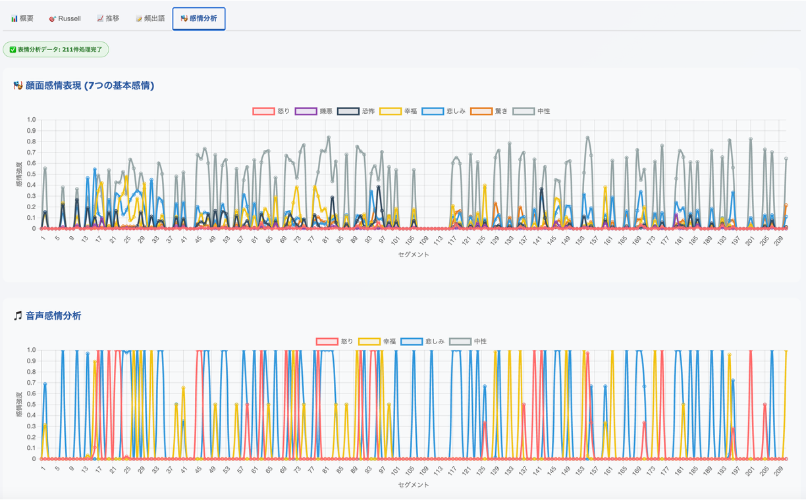
*図13: 感情分析詳細タブ - 顔面感情表現と音声感情分析*

#### テキスト感情分析
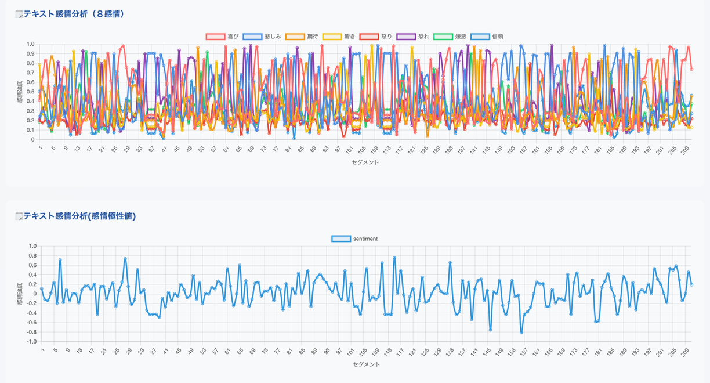
*図14: テキスト感情分析 - 8感情分析と感情極性値*

#### 頭部動作と表情分析
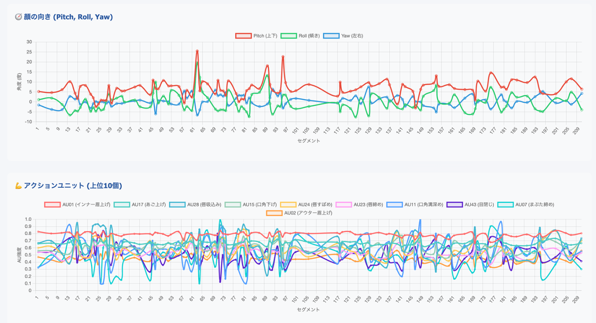
*図15: 頭の向き分析（Pitch, Roll, Yaw）とアクションユニット分析*

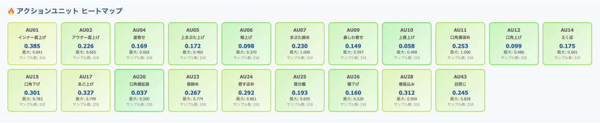
*図16: アクションユニット詳細 - 上位10個のヒートマップ表示*

### 7. 会話ビュー機能の詳細

#### 発話の詳細表示
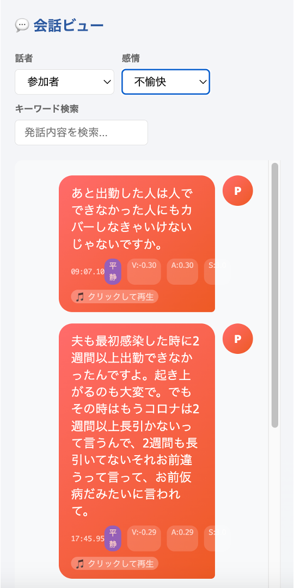
*図17: 会話ビュー - 発話詳細と感情スコア表示*

#### キーワード検索機能
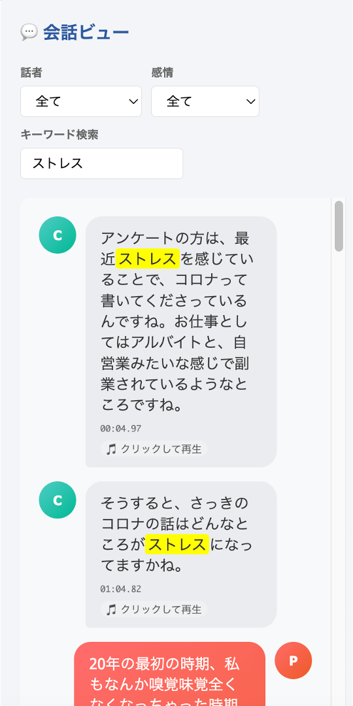
*図18: キーワード検索機能 - 「ストレス」での検索例*

#### データの可視化
- 全ての分析結果はインタラクティブなグラフで表示
- グラフ上の特定点をクリックすると該当する発話に移動
- 時系列での感情変化パターンを視覚的に把握可能

### 8. 操作のコツ
- 感情の変化が大きい箇所を特定するには、Russellタブの円環モデルが有効
- 特定のキーワードでの感情分析を行いたい場合は、会話ビューの検索機能を活用
- 音声・動画・テキストの各モダリティごとの分析結果を総合的に確認することで、より深い洞察が得られる

### 9. 注意事項
- ファイルサイズが大きいため、読み込みに時間がかかる場合があります
- 推奨ブラウザはGoogle Chromeです
- 音声・動画ファイルが正しく配置されていない場合、再生機能が利用できません
